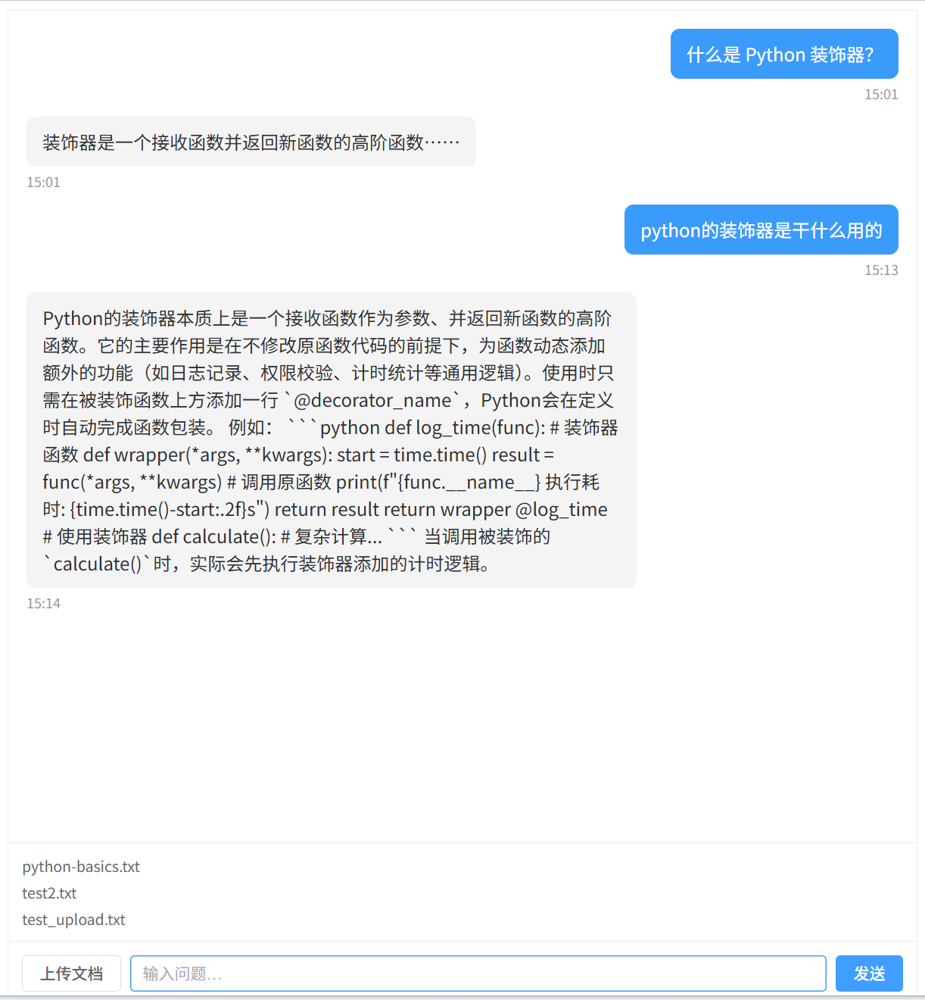
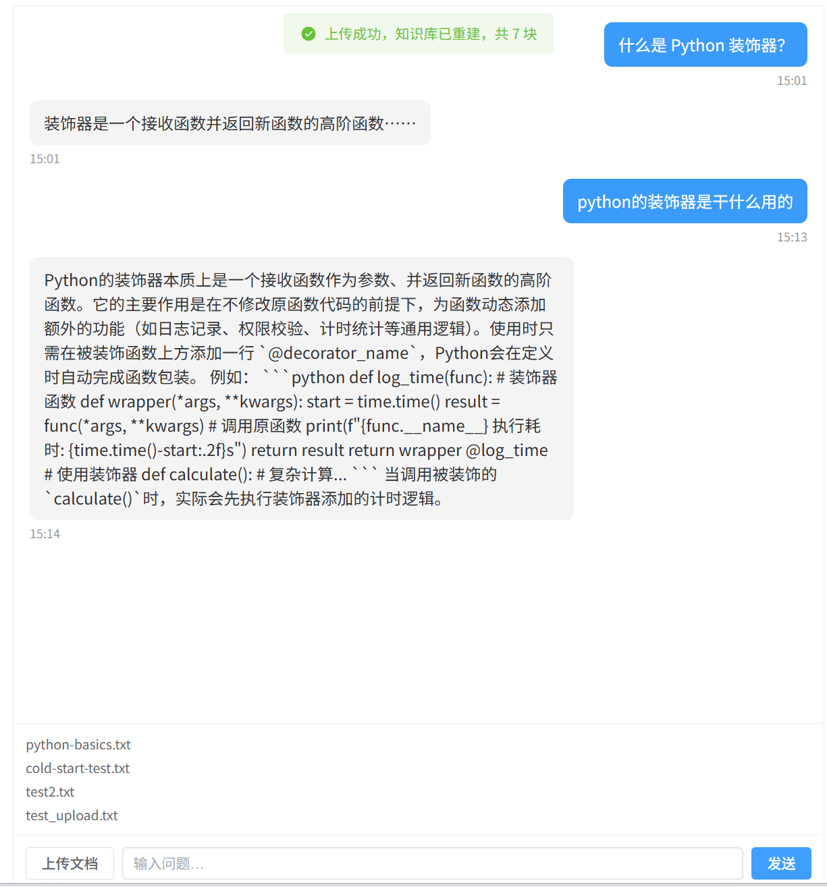
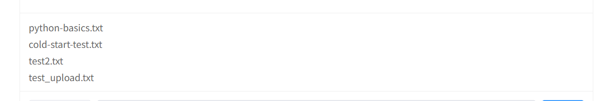

# AI 知识库问答系统

上传自己的文档，用自然语言提问，得到**基于文档内容**的回答。

基于 RAG（检索增强生成）架构：先把文档切块、向量化、存入 FAISS 索引；提问时检索出最相关的片段，拼进 prompt 交给大模型，让回答有据可依，而不是让模型凭记忆瞎编。

支持 txt 文档上传，上传后自动重建索引，无需重启服务即可检索到新内容。

---

## 技术栈

| 层 | 选型 |
|---|---|
| 后端 | Python 3.13 · FastAPI · Uvicorn |
| RAG | LangChain · FAISS（本地向量库） |
| 模型 | DeepSeek-V3（生成）· BAAI/bge-large-zh-v1.5（嵌入）· BAAI/bge-reranker-v2-m3（重排） |
| 前端 | Vue 3 · Vite · Element Plus · axios |
| 部署 | Docker 多阶段构建 · Docker Compose · Nginx |

模型全部通过硅基流动（SiliconFlow）API 调用，**不在本地加载模型权重**。

---

## 架构

```
                     浏览器
                        │
                        ▼
        ┌───────────────────────────────────┐
        │  kb-frontend   (Nginx, :80)       │
        │                                   │
        │   /       → 静态文件 dist/         │
        │   /api/   → http://backend:8000   │
        └───────────────┬───────────────────┘
                        │  Docker 内部网络（服务名寻址）
                        ▼
        ┌───────────────────────────────────┐
        │  kb-backend    (Uvicorn, :8000)   │
        │                                   │
        │   /app/data        ← kb_kb_data   │  源文档
        │   /app/faiss_index ← kb_kb_index  │  向量索引
        └───────────────┬───────────────────┘
                        │
                        ▼
              api.siliconflow.cn
        （DeepSeek-V3 / bge-large-zh / bge-reranker）
```

**两个容器，各司其职**：Nginx 负责发静态文件和转发 `/api` 请求（替代开发环境里 Vite 的代理），后端只关心业务逻辑，不暴露给浏览器。

---

## 核心链路

### 上传文档

```
浏览器选中 .txt
  → POST /api/v1/documents/upload（multipart）
  → 后端校验后缀 → 落盘到 /app/data/uploads/
  → rebuild_store()：全量读 samples/ + uploads/
                     → 切块（500 字 / 重叠 50）
                     → 调嵌入 API 转向量
                     → FAISS.from_documents() → save_local()
  → 返回 { filename, size, chunks }
```

### 提问

```
POST /api/v1/chat  { "question": "..." }
  → load_store()        从磁盘读回 FAISS 索引（每次请求现读，所以上传后无需重启）
  → similarity_search() 取最相关的 5 个块
  → 拼成 context，填进 prompt 模板
  → 调 DeepSeek-V3 生成
  → 返回 { "answer": "..." }
```

耗时分布：检索部分在**毫秒～微秒级**，端到端 6 秒左右，**99% 的时间在 LLM 生成**。

---

## 快速开始

需要 Docker Desktop 已启动。

```bash
git clone <repo-url>
cd 项目二

# 配置密钥（项目根建 .env，只有一行）
echo "SILICONFLOW_API_KEY=你的密钥" > .env

# 启动
docker compose up -d

# ⚠️ 首次必须执行一次：初始化向量索引
docker compose exec backend python -m app.rag.store
```

打开 **http://127.0.0.1:8081**。

> **为什么首次要手动建索引？** 索引存在 Docker 卷里，卷刚创建时是空的。持久化保证的是"数据不丢"，不等于"有内容"。

### 常用命令

```bash
docker compose ps                        # 看状态
docker compose logs -f backend           # 看日志
docker compose down                      # 停止（保留数据）
docker compose down -v                   # 停止并删除所有数据 ⚠️ 不可逆

# 改了代码后重建
DOCKER_BUILDKIT=0 docker compose up -d --build
```

> `DOCKER_BUILDKIT=0` 是为了绕开 Compose 的 bake 构建器对非 ASCII 路径（本项目目录名含中文）的兼容问题，详见 `docs/error-log.md` #14。

### 本机开发方式

```bash
# 后端
cd backend && ../venv/Scripts/python.exe -m uvicorn app.main:app --reload --port 8000

# 前端
cd frontend && npm run dev
```

详细启动顺序和排错决策树见 [`docs/run-guide.md`](docs/run-guide.md)。

---

## API

| 方法 | 路径 | 说明 |
|---|---|---|
| `GET` | `/api/v1/health` | 健康检查 |
| `POST` | `/api/v1/chat` | 提问，body `{"question": "..."}` |
| `POST` | `/api/v1/documents/upload` | 上传 txt（multipart，字段名 `file`） |
| `GET` | `/api/v1/documents` | 列出知识库里的所有文档 |

启动后端后可访问 `/docs` 查看自动生成的 Swagger 文档。

---

## 设计取舍

### 为什么嵌入走 API，不在本地跑模型

本地跑 `sentence-transformers` 要拖 `torch` + `transformers`，**镜像会从 620MB 涨到 2.5GB 以上**，冷启动也慢。走 API 后镜像保持 620MB，代价是每次检索多一次网络往返（毫秒级，相对 LLM 生成的 6 秒可忽略）。

### HyDE 与重排序：已实现，默认关闭

`app/rag/hyde.py`（假设文档检索）和 `app/rag/reranker.py`（BGE 重排）都已完成并单独可运行：

- **HyDE**：让 LLM 先写一段"像文档的段落"，用这段代替原始问题去检索。因为用户口语化的提问和文档的书面写法是两种"语言"，LLM 充当翻译。
- **重排序**：用 cross-encoder 对"问题 + 候选块"逐对打分精排，取分数最高的 3 块。与嵌入检索的区别是——嵌入是各编各的向量比距离，重排是一对一判读。

**但在实际问答链路里它们是关闭的**（`retriever.py` 里两个开关默认 `False`，`chain.ask()` 没有传 `True`）。

原因是**没有做过效果对比评估**。开启的代价是确定的：每题多一次 LLM 调用 + 一次 rerank API 调用，端到端耗时明显上升。收益则未经验证——在小规模中文技术文档上，HyDE 未必优于直接检索。

**不做没有依据的优化**，所以保持默认关闭，代码留着，需要时可以按开关启用、跑对比实验。要启用只需改 `chain.py` 里那一行。

### 容器里刻意保留目录层级

`config.py` 用 `Path(__file__).resolve().parents[2]` 推导项目根，这**硬编码了目录深度**。所以容器里的 `WORKDIR` 设为 `/app/backend` 而不是 `/app` —— 压平会让数据目录算到 `/data` 去。保持和本机一致的层级，顺带也让 `load_dotenv()` 的向上查找行为一致。

这是这种写法的代价：**目录结构变成了接口**。更稳的做法是用环境变量显式配置路径（`FAISS_INDEX_DIR` 已经改成这样了）。

### 前端多阶段构建

编译 Vue 需要 Node，但构建产物跑起来不需要。所以镜像分两阶段：Node 阶段编译出 `dist/`，Nginx 阶段只拷这一个目录。**最终镜像 95.4MB，里面没有 Node**；不这么做是 1GB 起步。

### 依赖清单从代码反查

`requirements.txt` 是逐个包 grep 代码 import 反查出来的，不是从教程抄的。审计时发现 `sentence-transformers` 全项目零引用却拖着 2~3GB 的依赖，已移除并在 Docker 构建中验证（`pip install` 的安装列表里确认没有 `torch`/`transformers`）。

---

## 已知限制

### 索引与源目录不同步

**手动删除或添加源文件不会触发索引更新。**

上传接口内部会调 `rebuild_store()` 全量重建，所以通过页面上传是同步的。但直接在文件系统里删文件不会——此时 `GET /documents` 的列表会变（它直接读目录），而问答**仍然能检索到已删除的内容**（检索只读 FAISS 索引）。

根因是两份数据源之间没有同步机制，且 `rebuild_store()` 只有上传接口一个调用点。

**当前不做修复。** 正确的解法是增量索引（FAISS 的 `add` / `delete` 接口），而不是再补一个全量重建的触发点——那是打补丁。在文档规模不大、重建成本可接受的现阶段，收益不足以支撑这次重构。

### 其他

- 只支持 `.txt`，PDF 加载器未实现
- 问答接口不返回引用来源（citation）
- `rebuild_store()` 是同步阻塞调用，跑在 `async def` 里会卡事件循环（正解是 `await run_in_threadpool(...)`）

---

## 项目结构

```
项目二/
├── backend/
│   ├── app/
│   │   ├── main.py              FastAPI 入口
│   │   ├── config.py            全部配置项集中在这里
│   │   ├── routers/             接口层（chat / document）
│   │   ├── rag/
│   │   │   ├── loader.py        读 txt
│   │   │   ├── splitter.py      切块
│   │   │   ├── embedder.py      嵌入（调 API，实现 LangChain Embeddings 接口）
│   │   │   ├── store.py         建库 / 存盘 / 读盘
│   │   │   ├── retriever.py     检索（含 HyDE 和重排开关）
│   │   │   ├── hyde.py          假设文档检索
│   │   │   ├── reranker.py      BGE 重排
│   │   │   ├── prompts.py       prompt 模板
│   │   │   └── chain.py         问答链：检索 → 拼上下文 → 调 LLM
│   │   └── utils/llm.py         调 LLM 的封装
│   ├── requirements.txt
│   └── Dockerfile
├── frontend/
│   ├── src/
│   │   ├── api/                 axios 实例（chat.js / document.js）
│   │   ├── views/ChatView.vue   问答 + 上传 + 列表（单页）
│   │   └── router/
│   ├── nginx.conf               生产环境的静态文件 + 反向代理配置
│   └── Dockerfile               多阶段构建
├── data/
│   ├── samples/                 种子文档
│   └── uploads/                 上传的文档
├── docs/                        开发笔记、错误日志、运行手册
├── docker-compose.yml
└── .dockerignore
```

---

## 开发记录

`docs/` 下保留了这个项目的完整开发过程：

- `run-guide.md` —— 运行手册（启动顺序、排错决策树、Docker 命令）
- `error-log.md` —— **16 条踩坑记录**，每条都写明场景、错误信息、根因、解法、预防
- `day-1` ~ `day-8` notes —— 分日笔记，含知识点、链路图、面试题

其中几条典型问题：

| # | 问题 | 教训 |
|---|---|---|
| 10 | `CHUNK_SIZE` 改了不生效 | 配置项定义了但没被使用，"不报错的错"最危险 |
| 11 | 重建索引把上传的内容全抹了 | 名为 `build` / `create` 的方法默认当覆盖写处理 |
| 13 | Nginx 拒绝启动 `host not found in upstream` | Nginx 解析 upstream 域名是在**启动时**，不是请求时 |
| 15 | 卷挂上了但索引是空的，问答 500 | "持久化"和"有内容"是两件事 |

---

## 截图






